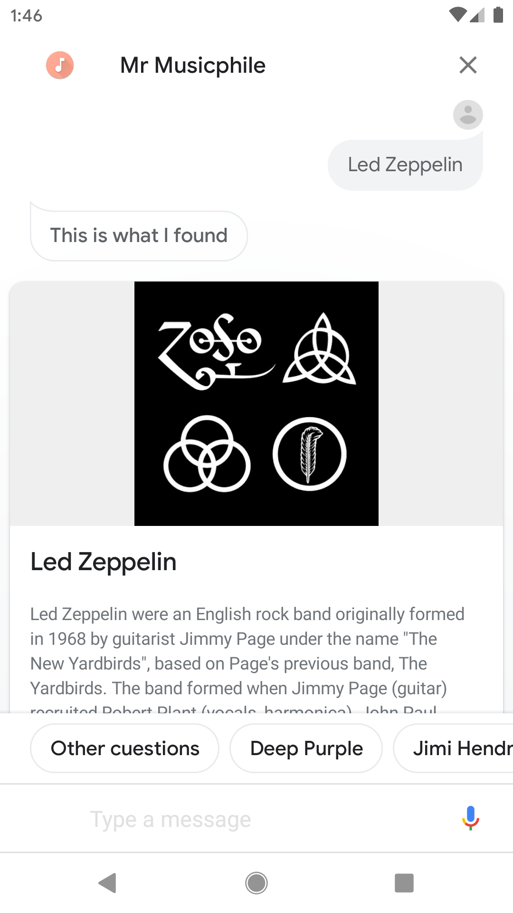
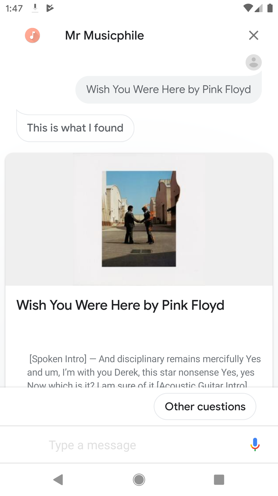
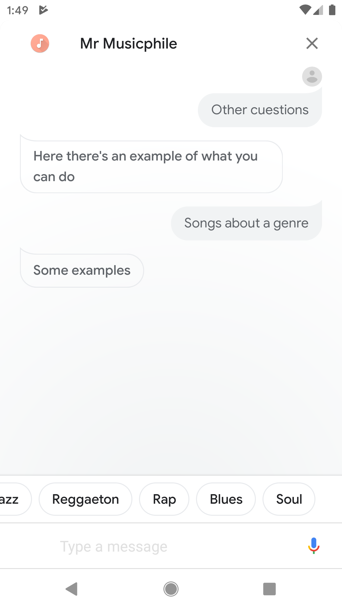
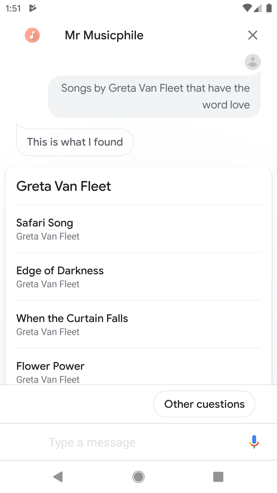

# Mr Musicphile - Actions on Google

 

Mr Musicphile is an agent to find information about artists, lyrics, artists songs that contain a specific word, songs by feels and songs by genres. Developed using Dialogflow and Cloud Functions.

- **Languages:** Spanish and English

## Use cases

### Information about an artist

Retrieves information about an artist. The information is extracted from Last.fm using the API.

#### Phrases

- I want information about artist
- Information about the artist artist
- Give information about artist

### Lyrics

Uses Genius API and Web Scraping to get the lyrics.

#### Phrases

- I want the lyrics of track by group
- I want the lyrics of track
- Search the lyrics of track
- Give me the lyrics of track

### Songs by genre

#### Phrases

- Songs of genre

 

### Songs of an artist that contain a specific term

For this use case, it's used the Musixmatch API

#### Phrases

- Songs by group that have the word word
- I want songs by group that have the word word

